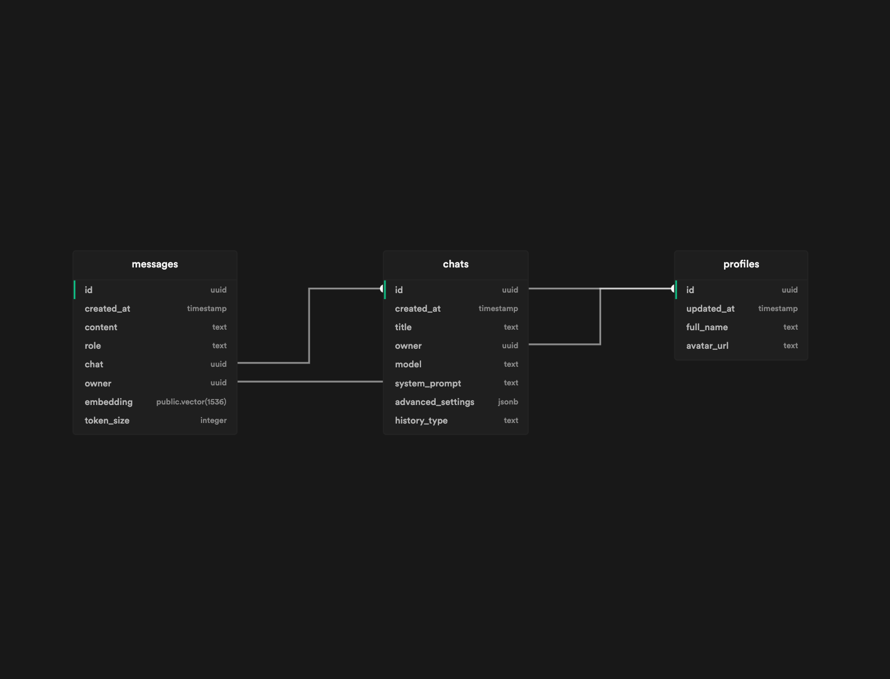

## Running Locally

**1. Create a Supabase Project**
The application holds conversations in a Supabase database. You can create a free account [here](https://supabase.io/).

NextGPT needs a Supabase URL and Anon Key to connect to your database. You can find these in your Supabase project settings.

You must create 3 tables in your supabase project:



You can create all the tables you need with the `sql function` that I cretead in the `sql` folder of the repo. You can use the `create-tables.sql` file in the `sql` folder of the repo to create the tables. Remember that you must enable the `pg_vector` extension before creating the tables.

You can use `create-profile.sql` to automatically create user profiles on sign up.

After you create the embedding column, you should create an `index` based on this column. You can use the `create-index.sql` file in the `sql` folder of the repo to create the index.

Finally, you must create a sql function called `search-messages` in your Supabase project. You can use the `search-messages.sql` file in the `sql` folder of the repo to create the function.

**2. Clone The Repo**

```bash
git clone https://github.com/devgoncalo/next-gpt
```

**3. Install Dependencies**

```bash
npm install
```

**4. Create Your Enviroment Variables**

Create your .env.local file in the root of the repo with your Supabase URL, Supabase Anon Key, Auth Redirect URL and OpenAI API Key:

```bash
NEXT_PUBLIC_SUPABASE_URL=YOUR_URL *required
NEXT_PUBLIC_SUPABASE_ANON_KEY=YOUR_KEY *required
NEXT_PUBLIC_AUTH_REDIRECT_URL=YOUR_URL *required
OPENAI_API_KEY=YOUR_KEY *optional
```

**4.1 Creating .env File**

1. Locate the file named `.env.example` in the main folder.
2. Create a copy of this file, called `.env` by removing the `template` extension. The easiest way is to do this in a command prompt/terminal window `cp .env.example .env`.
3. Open the `.env` file in a text editor. _Note: Files starting with a dot might be hidden by your Operating System._
4. Change environment variables as needed.
5. Save and close the `.env` file.

**4.2 OpenAI API Key**

When you set your `OpenAI API Key` as an environment variable, the application will not prompt you to enter it again to initialize itself. <span style="color:red; font-weight:bold;">BE CAREFUL</span> if you set your `OpenAI API Key` as an environment variable and host it anybody who accesses your hosted version can use it.

**4.3 Auth Redirect URL**

You must set your `Auth Redirect URL` on production as environment variable. If you don't set it, you will get an error when you try to sign in. Also, make sure you have the right `Auth Redirect URL` set in your Supabase project settings and in your environment variables that you created for Vercel. If you have different `Auth Redirect URL` for preview and production, you can set them as environment variables in Vercel and Supabase.

**5. Run Development Server**

```bash
npm run dev
```

## Configuration

When deploying the application, the following environment variables can be set:

| Environment Variable          | Required         | Description                            |
| ----------------------------- | ---------------- | -------------------------------------- |
| NEXT_PUBLIC_SUPABASE_URL      | Yes              | The base url of your Supabase Project  |
| NEXT_PUBLIC_SUPABASE_ANON_KEY | Yes              | The Anon Key for your Supabase Project |
| NEXT_PUBLIC_AUTH_REDIRECT_URL | Yes (Production) | The base url of your Supabase Project  |
| OPENAI_API_KEY                | Optional         | The Anon Key for your Supabase Project |

If you don't have an OpenAI API key, you can get one [here](https://platform.openai.com/account/api-keys).
